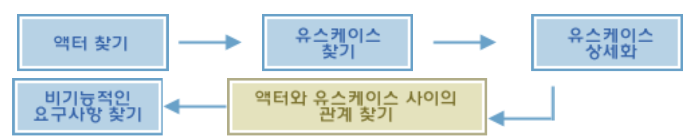

## 유스케이스(Use-cases)개념
---
유스케이스는 우리말로는 쓰임새라고 말한다. 유스케이스는 **쓰이는 경우**  혹은 **용도** 같은 의미다. 즉 어떤 일에 쓰느냐 하는 것.

유스케이스들을 모아서 시스템으로 연결시키는 것을 개발 과정의 간단한 정의로 볼 수 도 있다.

* 유스케이스는 사용자 시각에 맞춘 분석이다. 

어떤 시스템을 만드느냐를 사용자 입장에서 조망하는 것 이라고 할 수 있다. 
유스케이스는 시스템 보다는 그것을 사용하는 인간, 즉 사용자의 입장을 우선해서 시스템이 어떠해야 하는가를 알아보는 것이다.

* 유스케이스는 시스템의 행위를 결정하는 것이다.

구체적으로는 시스템의 기능을 정의하고, 범위를 결정함으로써 시스템과 외부 환경 변수를 구분하고, 상호 관계를 정립하는 것.

유스케이스를 나타내는 유스케이스 모델은 유스케이스 다이어그램으로 표현된다.

유스케이스 다이어그램은 액터(Actor, 행위자),유스케이스, 그리고 관계(Relationship)로 나타낸다.

* 액터 : 학생,은행시스템
* 유스케이스 : 수강신청

화살표는 액터와 유스케이스 간의 관계를 나타낸 것이다. 여기서는 단방향으로의 관계만 나타내고 있다.

위의 다이어그램은 학생이 웹에 접속해 수강신청을 하면(1단계), 그 정보가 은행 시스템에 입력이 되는 과정(2단계)을 나타낸다.

### 액터(Actors)

액터는 시스템의 일부가 아니다. 액터는 시스템과 상호작용을 하는 모든 것들을 나타낸다. 시스템을 사용하게 될 사람은 물론이고, 
연관된 다른 시스템도 액터다. 액터는 다이어그램 상에서 막대인간으로 표현된다.

대체로 액터의 행위는 정보의 입력과 출력으로 살펴볼 수 있다. 정보를 입력하거나 출력하는 액터가 있고, 입출력을 모두 행하는 액터가 있다.
액터를 뽑아낼때 다음과 같은 질문들이 요구사항 분석에서 액터를 뽑아내는데 도움을 준다. 

---
* 특정 요구사항에 이해 관계자는 누구인가?
* 어떠한 부서나 집단에서 시스템을 사용하는가?
* 시스템을 사용함으로써 이익을 얻는 이는 누구인가?
* 누가 시스템에 정보를 입력하고 사용하고 삭제하는가?
* 누가 시스템의 유지보수를 수행하는가?
* 시스템이 외부 자원을 사용하는가?
* 한 사람이 복수의 역할을 수행하는가?
* 여러 사람이 한 가지 역할을 수행하는가?
* 시스템이 기존 시스템(legacy system)과 상호작용하는가?
---

### 유스케이스(Use-case)

유스케이스 모델은 **시스템과 액터와의 의사소통을 표현** 한다. 각각의 유스케이스는 **시스템이 제공해야 하는 기능을 묘사** 하고, 이러한 유스케이스들이 **시스템 전체의 기능** 을 나타낸다. 유스케이스는 다이어그램 상에서 타원으로 나타낸다.
하나의 유스케이스는 액터가 원하는 기능을 수행하기 위해 시스템이 수행하는 일련의 처리의 연속이다.

다음과 같은 질문들이 요구사항 분석에서 유스케이스를 뽑아내는데 도움을 준다.

---
* 각각의 액터의 업무는 무엇인가?
* 액터가 시스템의 정보를 생성,저장,수정, 삭제하고 읽는가?
* 어떠한 유스케이스가 시스템의 정보를 생성,저장,수정,삭제하고 읽는가?
* 액터가 돌연한 외부 변화에 대한 정보를 시스템에게 알릴 필요가 있는가?
* 시스템에 갑자기 발생한 일들을 액터가 알아야하는가?
* 어떠한 유스케이스들이 시스템을 지원하고 유지하는가?
* 유스케이스들이 모든 요구되는 기능을 포괄하여 수행하는가?
---

## 관계

### 액터와 유스케이스의 관계

액터와 유스케이스와의 관계는 연관(Associtation) 혹은 커뮤니케이션 연관(Communicates Associtation)이라고 한다. 이는 액터와
유스케이스간의 의사소통을 나타내기 때문이다. 또한 연관은 진행되는 방향에 따라 2가지로 나뉜다.

* 단방향 연관 : 액터 혹은 유스케이스만이 연관을 유발
* 양방향 연관 : 액터와 유스케이스 양쪽 모두에서 연관을 유발

### 유스케이스간의 관계

유스케이스간의 관계는 2가지로 나눌 수 있다.

* 포함(Inclusion) : 여러 유스케이스들이 하나의 기능 조각을 공유할 때 이를 모든 유스케이스에 각각 집어 넣는 것보다는 이를 분리
해두고 필요한 유스케이스들이 이를 포함해서 사용하게 됨.
  * 예시 - 인터넷 사이트에 접속해서 각종 서비스를 제공받기 전에 늘 수행하는 회원인증과 같은 유스 케이스

* 확장(Extension) : 기본 유스케이스에서 특정 조건이나 액터의 선택에 따라 발생하는 유스케이스를 말함.
  * 예시 - ATM에서 사용자의 메뉴 선택에 따라 달라지는 유스케이스의 경우나 긴급 상황시에 발생할 수 있는 유스케이스

## 유스케이스 모델링 과정

* 액터 찾기 : 시스템을 개발한 후 이를 사용할 여러 타입의 사용자를 발견하는 작업

* 유스케이스 찾기 : 사용자와 상의하여 개발자가 미래에 개발될 구체적인 사례를 추출하는 과정으로 시스템의 범위를 결정

* 유스케이스 상세화 : 각 유스케이스를 구체화하고 시스템의 동작 오류와 예외조건을 포함하여 기술함

* 액터와 유스케이스 사이의 관계 찾기 : 액터와 유스케이스 사이의 통신관계, 유스케이스 사이의 확장관계, 유스케이스 사이의 포함관계를 정의

* 비기능적인 요구사항 찾기 : 사용자의 눈에는 보이지만 시스템의 기능과 직접적으로 관련이 없는 시스템의 성능,문서화,자원,품질 등의 요구사항을
찾는다.
